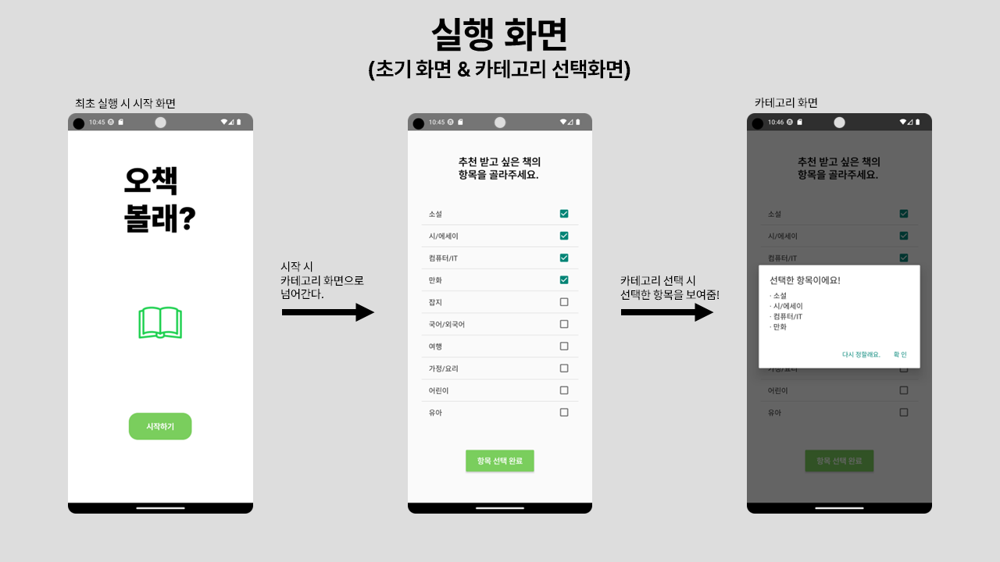
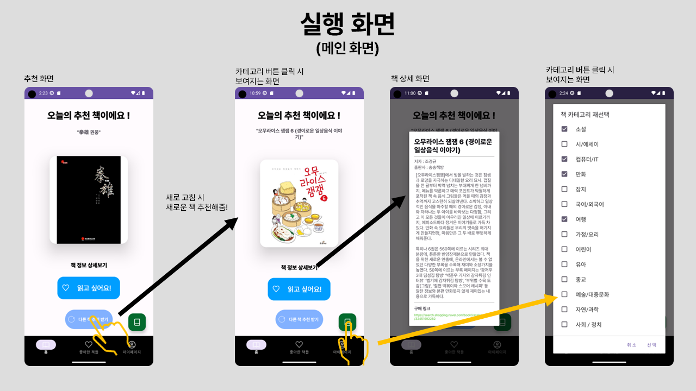
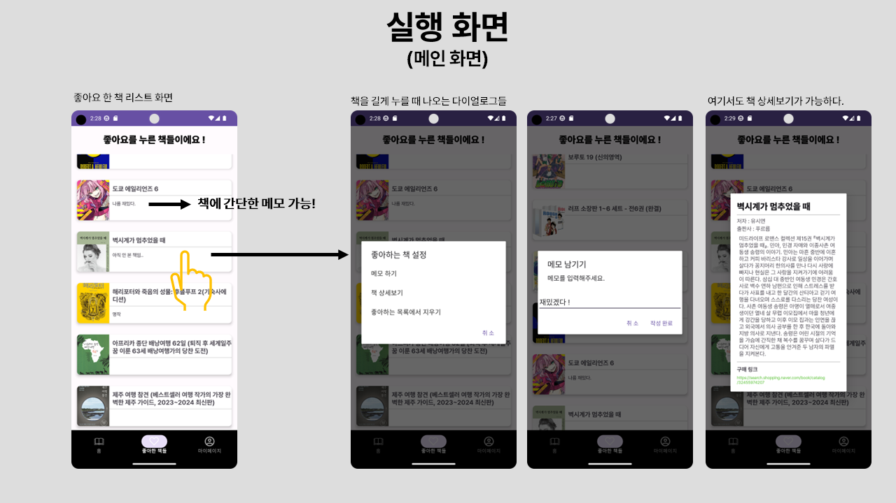
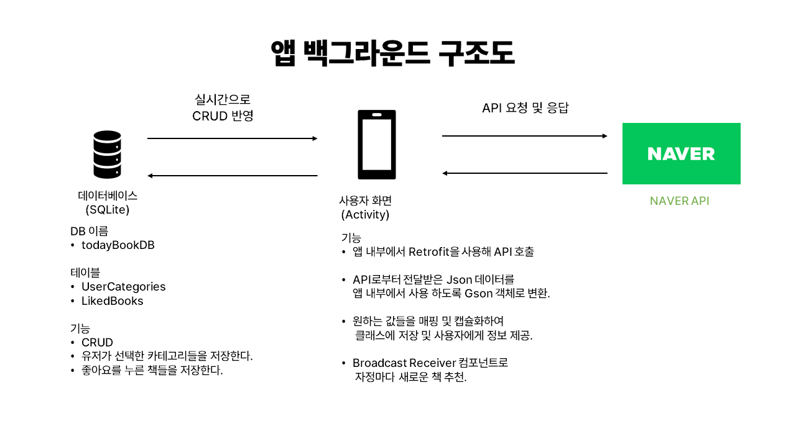
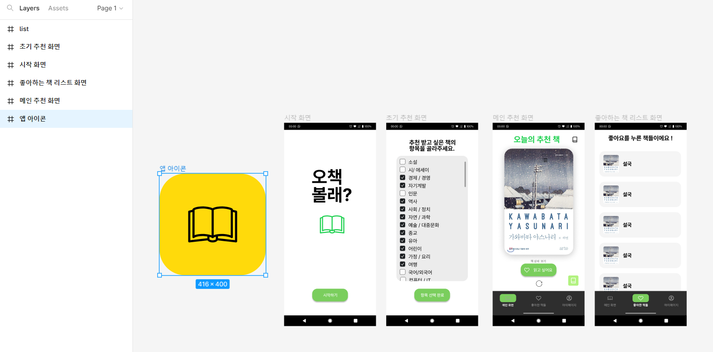

## 📗 오책볼래? ( `Android` )

선택한 카테고리에 따른 오늘의 책을 추천해주는 어플리케이션 

`Tools` :  <a href="#" target="_blank"></a> <a href="#" target="_blank"></a>

`Language` :  <a href="#" target="_blank"></a>&nbsp;

`DB` :  <a href="#" target="_blank"></a>&nbsp;

`API` : <a href="#" target="_blank"></a>&nbsp;

## 🧱 기능
+ 사용자가 선택한 카테고리에 따라, 매일 오늘의 책을 소개해주는 기능입니다.
+ 사용자는 원하는 책의 상세 정보를 볼 수 있습니다.
+ 책에 개인 메모를 입력할 수 있습니다.
+ 읽었어요 버튼을 통해 사용자가 읽고싶은 책들을 모아볼 수 있습니다.

## 📌 사용 기능 및 경험

+ `SQLite`를 이용한 로컬 DB 구축
+ `Naver API`를 이용해 데이터 요청 및 캡슐화
+ `RecyclerView`를 이용한 동적으로 책 리스트 생성
+ `Retrofit`으로 네이버 API와 통신해 정보 요청

## 📱 앱 실행 화면

+ **앱 최초 실행시 화면**


+ **메인 화면**


+ **좋아요한 책 리스트 화면**


___

## 🌳 프로젝트 트리

```md
📦todaybooks
 ┣ 📂Activity ㅡ 액티비티 패키지
 ┃ ┣ 📜BookCategoriesActivity.java
 ┃ ┣ 📜BookRecommendActivity.java
 ┃ ┣ 📜LikeBooksListActivity.java
 ┃ ┗ 📜MainActivity.java
 ┣ 📂Adapter ㅡ 책 리스트 생성 어댑터 패키지
 ┃ ┗ 📜LikeBooksListAdapter.java
 ┣ 📂API ㅡ 네이버 API 데이터 요청 및 캡슐화 패키지
 ┃ ┣ 📜APIClient.java
 ┃ ┣ 📜APIInterface.java
 ┃ ┣ 📜BookItem.java
 ┃ ┣ 📜BookSearchResponse.java
 ┃ ┗ 📜CategoryKewordUtility.java
 ┣ 📂DB ㅡ SQLite DB 패키지
 ┃ ┗ 📜todayBookDB.java
 ┗ 📂TaskReceiver ㅡ 브로드캐스트 리시버 패키지
   ┗ 📜DailyTaskReceiver.java
```

## 🧱 백그라운드 구조도



## 🎨 초기 UI 설계

